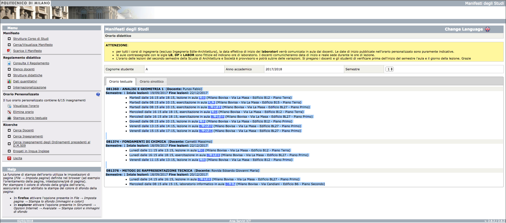

# polimi-schedule
Questo è uno script scritto in Python 2.7 che genera un file iCalendar (.ics) a partire dal formato testuale dell'Orario delle lezioni del Politecnico di Milano. Include un Servizio per macOS che permette di eseguire lo script direttamente da Google Chrome.

## Requisiti
* Python 2.7
* Modulo `icalendar`

## Utilizzo dello script
Lo script accetta come input attraverso `stdin` l'orario testuale, produce un file .ics e lo stampa in `stdout`. L'orario testuale a cui si fa riferimento può essere ottenuto dai [Servizi Online](https://www.polimi.it/servizionline/) del Politecnico o dal [Manifesto degli Studi](https://polimi.it/orario-lezioni). Il testo selezionato nello scheenshot qui sotto è ciò che deve essere passato via `stdin` allo script `generate_ical.py`.

## Utilizzo del Servizio (solo macOS)
Installare lo script `generate_ical.py` in `/usr/local/bin`. Aprire il file `Estrai orario lezioni....workflow` e selezionare "Installa".

In Google Chrome, visitare la pagina dell'orario testuale; selezionare l'orario come nello screenshot sopra, fare click destro e scegliere "Estrai orario lezioni..." dal menù contestuale. Il calendario verrà salvato sul desktop come `polimi_schedule.ics`.